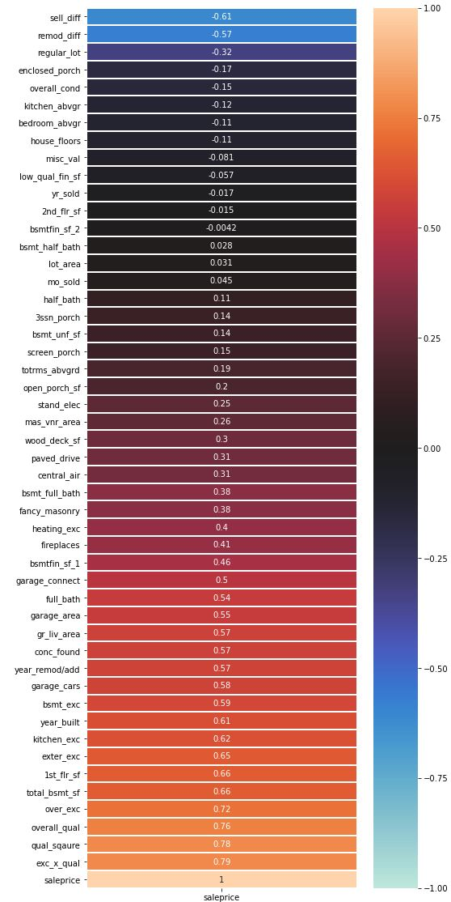
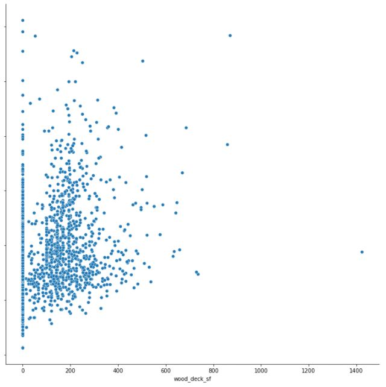
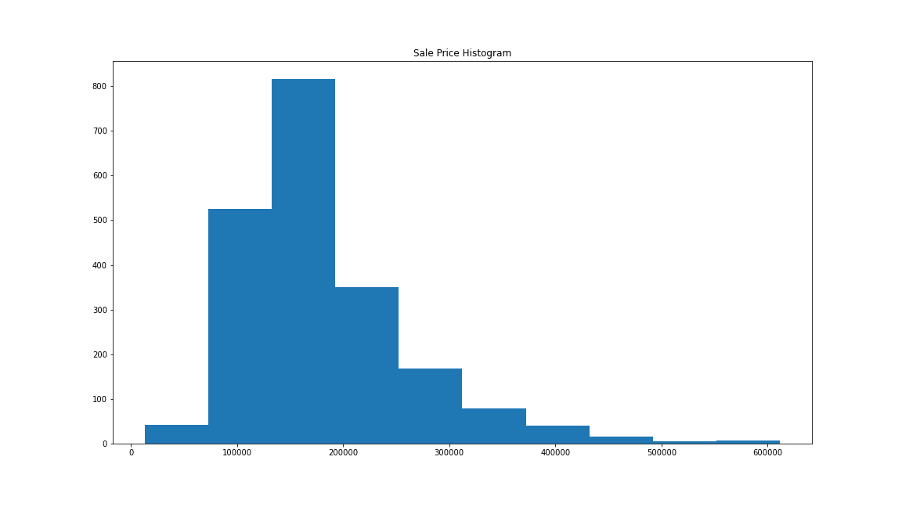
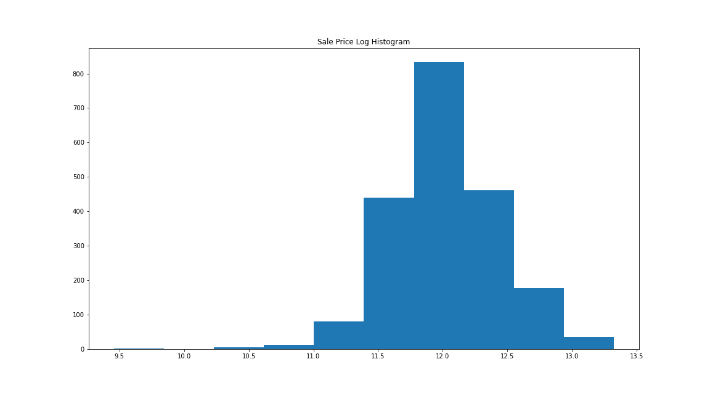

# Analyzing The Ames Housing Market

## Problem Statement

**Create and curate a set of synergistic features that gives insight in how to effectively increase a house’s value in Ames, Iowa**

The plan is to set up a base model using features that are immediately ready from our dataset. Next, I will add as many features in order to optimize the R2 score. Afterwards, I will play with the what features are active in order to make the best fitting model and maybe even raise the R2 score a bit. I will then analyze the Ames housing market based off what features made the grade and what features were cut. This insight will tell realtors and sellers alike the best ways to affect a home's price. 

I will look at multiple regression models and transform the sale price in order to achieve a normal distribution. Ultimately, I will only choose one model to evaluate as a key element is that I keep the modeling method consistent throughout in order to understand how the features are affecting the models and not other techniques.

List of baseline features found in the dataset(Ames Dataset Codebook): http://jse.amstat.org/v19n3/decock/DataDocumentation.txt  

## Data Dictionary

Below are custom features and the methodology for them:

| Field                    	| Description                                    	| Data Type 	|
|--------------------------	|------------------------------------------------	|-----------	|
| sell_diff              	| The amount of years between the house being built and the house being sold     	| int       	|
| remod_diff              	| The amount of years between the house being built and the house being remodeled            	| int       	|
| central_air              	| 1 = Central air, 0 = No central air            	| int       	|
| conc_found               	| 1 = Concrete foundation, 0 = Non-concrete foundation 	| int     	|
| fancy_masonry            	| 1 = Brick face or stone masonry, 0 = Other or no masonry 	| int     	|
| garage_connect          	| 1 = Ground level garage connected to house, 0 = Other or no connection 	| int    	|
| house_floors            	| Total amount of floors in a house                	| float   	|
| paved_drive              	| 1 = Paved driveway, 0 = Partial or non-paved driveway        	| int    	|
| regular_lot              	| 1 = Regularly shaped lot, 0 = Irregularly shaped lot         	| int    	|
| stand_elec              	| 1 = Standard breaker system, 0 = Fuse box or mixed system       	| int       	|
| bsmt_exc              	| 1 = Basement exceeds average, 0 = Average or below	| int       	|
| exter_exc             	| 1 = Exterior exceeds average, 0 = Average or below	| int       	|
| heating_exc             	| 1 = Heating exceeds average, 0 = Average or below	| int       	|
| kitchen_exc             	| 1 = Kitchen exceeds average, 0 = Average or below	| int       	|
| over_exc              	| (bsmt_exc + exter_exc + heating_exc + kitchen_exc) ** 2 	| int       	|
| qual_sqaure             	| (overall_qual) ** 2           	| int  	|
| exc_x_qual               	| qual_square * over_exc           	| int   	|

| Field                    	| Neighborhood                                    	| Data Type 	|
|--------------------------	|------------------------------------------------	|-----------	|
| n_Blueste                	| Bluestem                                      	| int, dummy   	|
| n_BrDalee                 	| Briardale                           	| int, dummy    	|
| n_BrkSide                  	| Brookside                           	| int, dummy    	|
| n_ClearCr                  	| Clear Creek                         	| int, dummy   	|
| n_CollgCr              	| College Creek    	| int, dummy      	|
| n_Crawfor             	| Crawford           	| int, dummy   	|
| n_Edwards               	| Edwards                                                 	| int, dummy   	|
| n_Gilbert               	| Gilbert                                                 	| int, dummy   	|
| n_Greens               	| Greens                                                 	| int, dummy   	|
| n_IDOTRR               	| Iowa DOT and Rail Road                                                 	| int, dummy   	|
| n_Landmrk               	| Landmark                                                 	| int, dummy   	|
| n_MeadowV               	| Meadow Village                                                 	| int, dummy   	|
| n_Mitchel               	| Mitchell                                                 	| int, dummy   	|
| n_NAmes               	| North Ames                                                 	| int, dummy   	|
| n_NridgHt               	| Northridge                                                 	| int, dummy   	|
| n_OldTown               	| Oldtown                                                 	| int, dummy   	|
| n_SWISU               	| South & West of Iowa State University                                                 	| int, dummy   	|
| n_Sawyer               	| Sawyer                                                 	| int, dummy   	|
| n_SawyerW               	| Sawyer West                                                 	| int, dummy   	|
| n_Somerst               	| Somerset                                                 	| int, dummy   	|
| n_StoneBr               	| Stone Brook                                                 	| int, dummy   	|
| n_Timber               	| Timberland                                                 	| int, dummy   	|

## Data Visualization

The correlation of available features according to sale price:

Features with an absolute value of .5 or greater were ultimately chosen for modeling as they had the greatest impact on the R2 scores while keeping overfitting to a minimum. While a lot of new features look promising, some did not perform as well ('regular_lot', 'fancy_masonry', 'paved_drive', 'heating_exc', 'central_air', 'stand_elec'). Also, only one was truly poor feature, which, surprisingly, was 'house_floors'. I would have been confident prior to this project that an increase in floors would lead to an increase in price, although how to evaluate split floors might come into play with this poor correlation.  

Some outliers were also scrubbed from the dataset in order to have more predictable modeling, such as this house that had a 1400 square foot deck!

  
The sales price was transformed from a skewed dataset:

To a more normally distributed one:

This will hopefully improve scores overall, but is not the major goal of the project.

## Model One: Baseline

Features:
* 'overall_qual'  
* 'gr_liv_area' 
* 'garage_area' 
* 'garage_cars'
* 'total_bsmt_sf' 
* '1st_flr_sf'
* 'year_built'
* 'year_remod/add' 
* 'full_bath'
* 'mas_vnr_area'
* 'totrms_abvgrd'

Some important things to note are that besides 'overall_qual', all of these features are objective and do not require experts to evaluate the house. Also, most of these features would be incredibly expensive to make changes to and might not be efficient to change to increase a house's value.  

Ridge Scores:
* CV R2: 0.824
* Mean Squared Error: 546,945,723
* Root Mean Squared Error: 23,386

The R2 score means that we can account for 82.4% of variance using this model. The squared errors seem high, but truly do not mean anything on their own and will only be important when comparing models to each other.

## Model Two: Full Features

Features:
* 'overall_qual'  
* 'gr_liv_area' 
* 'garage_area'
* 'garage_cars'
* 'total_bsmt_sf'
* '1st_flr_sf'
* 'year_built'
* 'year_remod/add' 
* 'full_bath'
* 'mas_vnr_area'
* 'totrms_abvgrd'
* 'sell_diff'
* 'remod_diff'
* 'neighborhood'
* 'garage_connect'
* 'conc_found'
* 'bsmt_exc'
* 'kitchen_exc'
* 'exter_exc'
* 'over_exc'
* 'exc_x_qual'

Five out of nine features added require experts to evaluate, and four are objective. Also, six out of nine added are tied to common remodeling techniques that people employ to increase a house's value.  

Ridge Scores:
* CV R2: 0.860 (4.37% increase over previous model)
* Mean Squared Error: 458,006,241 (16.26% increase over previous model)
* Root Mean Squared Error: 21,401 (8.49% increase over previous model)

These improvements tell me that I am on the right track to adding features that better predict the housing market. In the next model, I will attempt to remove some of the noise in the model.

## Model Three: Optimal Features

After many iterations, this feature set achieved the best results.

Features:
* ~~'overall_qual'~~
* 'gr_liv_area' 
* 'garage_area'
* ~~'garage_cars'~~
* 'total_bsmt_sf'
* '1st_flr_sf'
* ~~'year_built'~~
* ~~'year_remod/add'~~
* ~~'full_bath'~~
* ~~'mas_vnr_area'~~
* 'totrms_abvgrd'
* ~~'sell_diff'~~
* 'remod_diff'
* 'neighborhood'
* 'garage_connect'
* 'conc_found'
* 'bsmt_exc'
* 'kitchen_exc'
* 'exter_exc'
* 'over_exc'
* 'exc_x_qual'

Six out of seven features dropped are objective and do no require experts to evaluate the house. Five out seven are features are qualities that either a seller cannot change or would be very expensive to do so. Finally, six out seven features dropped were baseline, meaning the custom features are quite strong and have a sizable effect in the model.  

Ridge Scores:
* CV R2: 0.872 (1.40% increase over previous model)
* Mean Squared Error: 426,109,285 (6.96% increase over previous model)
* Root Mean Squared Error: 20,642 (3.55% increase over previous model)

These improvements are not as drastic, but inform us that the model now has less noise.

| Coefficient                    	| Score                                    	|
|--------------------------	|------------------------------------------------	|
| garage_cars                	| -7922                                    	|
| over_exc                	| -2543                                    	| 
| full_bath                 	| -2378                          	| 
| exter_exc                  	| -1133                        	| 
| totrms_abvgrd              	| -870    	| 
| remod_diff             	| -477           	| 
| sell_diff               	| -424                                                 	| 
| year_built               	| -272                                                 	| 
| year_remod/add           	| -219                                                 	|
| total_bsmt_sf            	| 19                                                	|
| 1st_flr_sf            	| 24                                                	|
| mas_vnr_area             	| 31                                                 	|
| gr_liv_area             	| 38                                                	|
| garage_area              	| 49                                                 	| 
| exc_x_qual               	| 62                                             	| 
| bsmt_exc               	| 564                                                 	|
| conc_found               	| 1250                                                 	|
| overall_qual               	|  4919                                            	|
| garage_connect               	| 5912                                             	| 
| kitchen_exc               	| 7608                                             	| 

All else equal, every unit increase in a coefficient will increase sale price by its score. It looks like the kitchen is the area of the house that has the most impact on sale price.

## Analysis

* There was a marked improvement when transforming the data and features. Important to note that just a 1% in accuracy is measured in thousands of dollars. Little improvements can mean a lot.
* The final model preferred a greater ratio of subjective features over objective features. This insight means that experts evaluating the houses plays a critical part in evaluating house sales and that we cannot rely solely on raw objective numbers. Realtors will want to look into finding the best evaluators in order to make the best offers maximizing profit.
* The final model preferred a greater ratio of features that easier to change (ex. kitchen quality, basement quality, time since last remodel, etc.) than ones set in stone (ex. type of foundation, how the garage connects to the house, the year the house was built, etc.). This insight is great for home owners as they have a high level of agency of increasing the value of their home rather than being victims to the housing market. It also implies that remodeling might be an avenue for realtors to invest in to widen their business.

## Data to consider

* Does the realtor who sold the play a part in increasing house value? How about houses that were staged versus ones that were not? Time on the market could certainly impact sale price as well, but there is no information on that.
* Very little information is given on how quality scores are given out. For example, what separates a 7 kitchen from a 6 kitchen? This further insight might give us a sharper eye in what the highest value houses are.
* Are there better evaluators of house quality out there? They could possibly help increase our models' scores.
* Fitting more house area improvements could give better analysis to renovators looking to figure out the most efficient ways to increase house price.